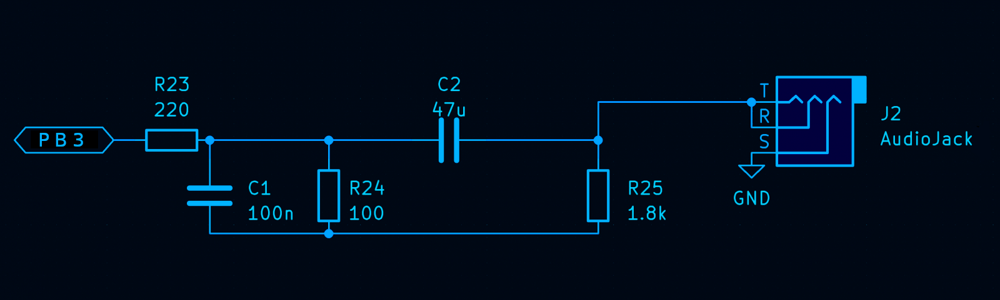

# ATTINY3226 talking thermometer

https://github.com/user-attachments/assets/9c1e372b-2eaa-4c26-85d8-df196d5cc732

## Connections

 - a 100nF decoupling capacitor between pins `VDD` and `GND`
 - simple low-pass filter on pin `PB3`
   
   

 - LED in series with a ~500Ohm resistor connected between `PB4` and `GND` (optional)

## Building and flashing


```
mkdir build
cd build
cmake -DCMAKE_BUILD_TYPE=Release -DAVR_MCU=attiny3226 \
      -DAVR_PROGRAMMER=serialupdi -DAVR_PROGRAMMER_PORT=/dev/ttyUSB0 \
      -DMCU_FREQ=10000000 -DCMAKE_TOOLCHAIN_FILE=../toolchain-avr-gcc.make ..
make -j
make upload_main
```

